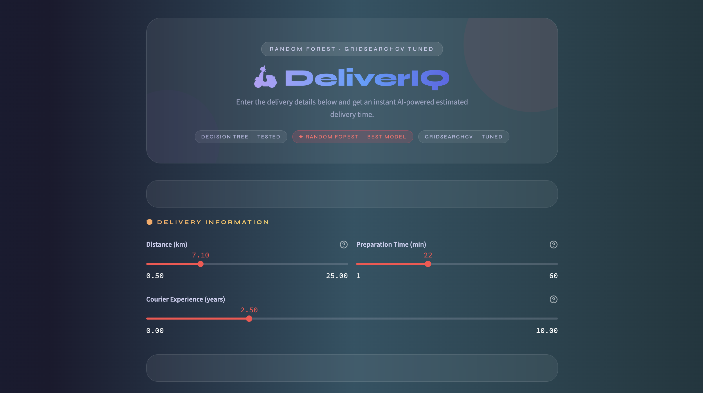

Food Delivery Time Prediction
Predicts how long a food delivery will take based on real conditions — distance, weather, traffic, vehicle type, and courier experience. Deployed as a live web app that anyone can use without touching code.
Live Demo: https://food-delivery-time-by-sourabh.streamlit.app/

## Project Dashboard

Problem Statement
Delivery time estimation is one of the most important parts of the food delivery experience. A bad estimate frustrates customers. This project builds a regression model that predicts delivery time in minutes using order and environmental conditions as input.

Workflow
Data Loading → EDA → Feature Engineering → Model Training → Hyperparameter Tuning → Deployment
Step	What I Did
EDA	Analyzed distributions, checked correlations, identified key factors affecting delivery time
Feature Engineering	One-hot encoded categorical features — Weather, Traffic Level, Time of Day, Vehicle Type
Model 1	Trained Decision Tree Regressor — baseline model
Model 2	Trained Random Forest Regressor — significant improvement over Decision Tree
Tuning	Applied GridSearchCV on Random Forest to find the best hyperparameters
Deployment	Built full Streamlit web app with real-time prediction and delivery insights
Model Results
Model	R2 Score (Test)	MAE	MSE
Random Forest + GridSearchCV	0.7779	6.96 min	107.81
Training R2: 0.8506 — Testing R2: 0.7779
The gap between training and testing score is reasonable and expected for a real dataset. The model is not overfitting — it generalises well to unseen data.
GridSearchCV helped find the optimal combination of n_estimators, max_depth, and min_samples_split without manually guessing.

Tech Stack
Python Pandas NumPy Scikit-learn Matplotlib Seaborn Streamlit Joblib

Project Structure :-
food-delivery-prediction
app.py                        # Streamlit web application
rf_model.pkl                  # Trained Random Forest model (GridSearchCV tuned)
Food_Delivery_Times (1).csv       # Dataset
DecisionTree_and_RandomForest.ipynb                # Full analysis and training notebook
Dashboard.png                 # App screenshot
requirements.txt
README.md

What I Learned
Random Forest was a clear step up from Decision Tree — the ensemble approach of combining many trees made a real difference in generalisation. But what GridSearchCV taught me was more valuable than the accuracy gain itself.
Before tuning, I was guessing hyperparameters. After GridSearchCV, I understood why certain values of n_estimators and max_depth work better for this kind of data. That shift from guessing to systematic search is something I will carry into every project going forward.

About Me
I am a data science learner focused on building complete projects — from raw CSV to deployed application. I do not stop at the notebook.
* GitHub: [your-username](https://github.com/sourabh9098/)
* LinkedIn: www.linkedin.com/in/sourabh9098
* Email: www.sourabh555@gmail.com
Not just a model. A product.

